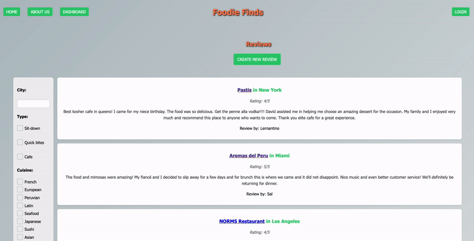

# Foodie Finds
  
  
  
  ## Description
  
  Foodie finds was created to help people who are looking for restaurants that cater to their specific dietary needs. This app has a minimalist design and a user-friendly interface with a clear navigational structure that makes it easy to use. The user will be able to add their own review for a restaurant they've visted which will be saved to their account dashboard, as well as see other reviews of restaurants based off their filters.

  This app was created using HTML5, CSS, front-end JavaScript, node.js with backend JavaScript, MySQL databate, and sequelize. This app uses an external API for TripAdvisor content. 

  Link to deployed app: https://restaurant-blog-3f12d3a2bc88.herokuapp.com/ 
  
  ## Table of Contents
  
  - [Installation](#installation)
  - [Usage](#usage)
  - [Credits](#credits)
  - [License](#license)
  - [How-to-contribute](#how-to-contribute)
  
  ## Installation
  N/A
  
  ## Usage
  User can search for reviews in the database by navigating on the homepage or applying any filters. See below for a demonstration

  User can add their own review by hitting the 'create new review' button. If the user is not logged in, they will be prompt to do so. The user is able to create an account and stay logged in for the duration of the session

    
  
  ## Credits
  External API used: https://tripadvisor-content-api.readme.io/reference/overview
  
  Team members: 
  - Beatriz Bravo - [BeaBravo](https://github.com/BeaBravo)
  - Nick Catalano - [NicholasCatalano](https://github.com/nicholascatalano)
  - Brandon Orellana - [OrellanaB5](https://github.com/OrellanaB5)
  - Yuliya Tsoy - [YuliyaTsoy](https://github.com/YuliyaTsoy)
  - Hongbo Wu - [HongboWu](https://github.com/hongbowu)

  
  ## License
  This application is covered under [MIT](https://choosealicense.com/licenses/mit/) license
  
  
  ## How to Contribute
 If you would like to contribute to our project, you can find the repo on https://github.com/nicholascatalano/restaurant-blog
